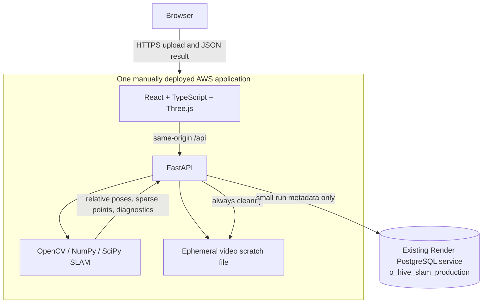

# O-HIVE Assignment 2: Monocular Sparse SLAM Design

## Intent and success criteria

Build a defensible, public, manually deployed Assignment 2 application that turns a short monocular RGB video into a real relative camera trajectory and sparse 3D map. The evaluator must be able to see, inspect, and explain the geometry. Success requires a 10.0-second benchmark video to complete pure SLAM processing in at most 10.0 seconds on the documented AWS host, while invalid, low-texture, and tracking-loss inputs fail honestly without fabricated geometry.

The implementation is isolated under `C:\Users\user\Downloads\o-hive\ass2`. It never changes Assignment 1 resources or source. GitHub is public source hosting only: no Actions, workers, automatic deploys, CodePipeline, or CodeBuild.

## Chosen approach

Three deployment/runtime options were considered:

1. **One compute-optimized EC2 Docker host (selected).** Predictable CPU, memory, local scratch space, direct benchmark attribution, no synchronous serverless payload/runtime ceiling, and a small explainable infrastructure surface.
2. **AWS App Runner.** Simpler managed ingress but less predictable CPU scheduling and a higher always-on service floor for this benchmark-sensitive workload.
3. **Lambda container.** Attractive idle cost, but video upload limits, cold-start/native dependency overhead, ephemeral execution constraints, and benchmark variability conflict with the required workflow.

The algorithm uses classical geometry rather than a neural black box: resized/sampled frames, Shi-Tomasi corners with pyramidal Lucas-Kanade tracking for adjacent frames, ORB descriptors on keyframes for recovery/map association, Essential Matrix initialization, cheirality-filtered triangulation, map-anchored PnP, bounded keyframes, and robust sliding-window local bundle adjustment. This maximizes explainability and CPU throughput.

## Architecture

The same container may be deployed as one manual Render mirror with `autoDeploy: false`. The browser receives no database credentials. Video bytes and raw point clouds are never stored in PostgreSQL.

## SLAM data flow

1. Validate filename, declared type, bounded byte count, actual container/codecs, duration, resolution, FPS, and frame count.
2. Save a UUID-named temporary file solely because OpenCV video decoding requires a seekable source; delete it in a `finally` block.
3. Decode at a deterministic processing profile: cap the long edge, cap processed frames, and sample evenly enough to retain real motion.
4. Build `K` from supplied `fx/fy/cx/cy` or label the dimension-derived focal assumption as approximate.
5. Detect Shi-Tomasi corners; track them with forward/backward LK and RANSAC filtering.
6. Initialize only when an Essential Matrix has sufficient inliers and `recoverPose` yields valid relative motion.
7. Triangulate between useful keyframes, retaining finite points with positive depth, minimum parallax, bounded relative depth, and bounded reprojection error.
8. Associate tracked 2D features with persistent 3D landmarks. Estimate subsequent camera poses using `solvePnPRansac`, then refine on inliers.
9. Create keyframes when motion/parallax, tracking degradation, or maximum temporal spacing warrants it. Keyframe ORB descriptors support re-association; the normal hot path remains LK.
10. Run local bundle adjustment on a capped subset of landmarks observed in the most recent 3–5 keyframes. Fix the oldest pose as the local gauge, optimize pose vectors and landmark positions with `scipy.optimize.least_squares(loss="soft_l1")`, and accept only finite improvements.
11. Return raw relative coordinates plus separately normalized visualization coordinates, diagnostics, and a clear partial/failure category.

## Drift reduction

Pure pairwise pose chaining is not accepted as sufficient. Two real anchors reduce drift:

- PnP estimates the current pose against persistent 3D landmarks rather than integrating only the latest relative transform.
- Sliding-window bundle adjustment jointly minimizes recent reprojection residuals for camera poses and a bounded landmark set.

A deterministic synthetic test introduces controlled camera/landmark noise and must prove post-optimization reprojection error is lower than pre-optimization error. Full global loop closure and Sim(3) pose-graph optimization are intentionally outside scope.

## Coordinate and scale conventions

World-to-camera poses are stored as 4×4 transforms with a single documented convention. Camera centers are derived as `-R.T @ t`. Monocular translation and map coordinates are in arbitrary relative units; the UI and README never call them meters. Visualization centering/scaling is derived without mutating the raw result.

## API and persistence

- `POST /api/slam-runs`: multipart video plus optional calibration; returns a completed/partial result or typed safe error.
- `GET /api/slam-runs/{run_id}`: small persisted metadata/result summary, not raw video.
- `GET /health`: process liveness.
- `GET /ready`: verifies PostgreSQL connectivity and the `slam_runs` table.

`slam_runs` uses UUID identifiers and Alembic revision `20260920_slam_01_initial`. Assignment 2 uses the isolated logical database `o_hive_slam_production` with a dedicated role where possible. Point arrays stay response-only; metadata records processing profile, counts, timing, algorithm version, and bounded error fields.

## Security, privacy, and resource controls

- Allowlist MP4/MOV/WebM/WebM-compatible codecs after actual decode; reject masquerading files.
- Enforce per-file bytes, duration, dimensions, frames, concurrent-run semaphore, per-address rate limit, and processing timeout.
- Generate temporary UUID paths; original filenames are display-only and traversal-stripped.
- Delete temporary uploads after success, partial result, timeout, cancellation, or exception.
- Disable production docs/debug, validate hosts, use same-origin production, send CSP/frame/nosniff/referrer/permissions headers, and return no stack traces.
- Use an EC2 instance profile and Session Manager, require IMDSv2, encrypt/delete EBS on termination, and avoid SSH keys, NAT gateways, load balancers, and Elastic IPs unless measurements force a change.
- Use one public HTTP/HTTPS ingress path with a narrow security group. Production TLS will use the least-complex measured option available during deployment; the exact URL and cost are reported honestly.

## Frontend experience

The app opens into a three-stage workspace: Upload, Reconstruct, Explore. It defaults to light mode, persists a deliberate dark choice, and uses purposeful glass surfaces only for navigation, upload, processing, controls, and inspector overlays. Dense diagnostics remain high-contrast.

Before processing, the user sees video metadata, a restrained preview, limits, calibration disclosure, and optional advanced intrinsics. During processing, real backend stages are shown through an accessible `aria-live` status. Success opens a Three.js canvas with orbit/pan/zoom, point-cloud and trajectory toggles, reset, keyframe markers, normalized-view disclosure, textual summary, and compact diagnostics. Failure states map to actionable categories rather than generic errors.

## Testing and performance

Geometry tests use deterministic synthetic cameras/landmarks rather than brittle exact assertions on arbitrary videos. Tests cover validation, intrinsics, tracking, Essential Matrix failure, pose composition, triangulation filters, PnP failure, keyframes, reprojection error, bundle-adjustment improvement, serialization, cleanup, API persistence, readiness, security headers, and frontend states.

`scripts/benchmark_slam.py` reports source duration/resolution/FPS, processing resolution/effective FPS, decoded and processed frames, keyframes, sparse points, median reprojection error, pure processing time, HTTP time, ratio, environment, and PASS/FAIL. The included generator creates a licensed synthetic textured translation video, low-texture failure video, rotation-heavy difficult video, and exact 10-second benchmark. Processing fewer than a meaningful configured sample count is not accepted as a performance shortcut.

## Deployment and cost posture

Deployment is manual from a reviewed immutable commit. Start with the smallest compute-optimized EC2 type that passes the AWS benchmark; measure locally and on `c7i.large`, then move to `c7i.xlarge` or `c7i.2xlarge` only if required. On-Demand is preferred for evaluator reliability; Spot is documented as an optional interruption-prone mode. The stack uses minimal encrypted gp3 storage, short log retention, no CI/CD, and the existing account budget/alerts without modifying Assignment 1's Qwen stack.

The Render mirror uses the same Dockerfile, one web service, `autoDeploy: false`, and the existing PostgreSQL service through an isolated Assignment 2 database. The free-database expiry and cold-start limitations are documented.

## Known limitations

Global metric scale is unavailable; approximate intrinsics reduce geometric accuracy; low texture, pure rotation, fast motion, blur, rolling shutter, dynamic objects, and weak parallax can fail; the output is sparse; there is no dense reconstruction or full global loop closure; short offline uploaded videos are the target rather than long videos or live-camera SLAM.
